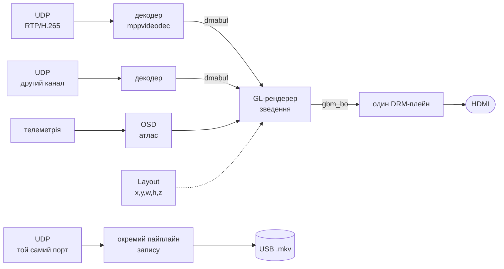

# VRX-GL

Приймальна станція цифрового FPV-лінка. Переписування [VRX](https://github.com/VTK-TEAM/VRX) з нуля заради переносимості між чіпами.

Приймає відео по UDP, виводить через DRM/KMS **без композитора й без X-сервера**, малює поверх OSD з телеметрії і паралельно пише на USB.

---

## Чому переписується

Старий VRX виводить кожен потік окремим апаратним плейном: відео, PiP, OSD — три незалежні вікна, які зводить VOP2. Це найдешевший можливий шлях за затримкою, але він **існує лише на RK3588**.

| Чіп | Незалежних вікон з лінійним NV12 |
|---|---|
| RK3588 | **4** (Esmart0-3) |
| RK3576 | **6** |
| RK3568 | **2** |
| **RK3566** | **1** |

На RK3566 `Cluster` приймає лише AFBC, `Smart` — лише RGB. Тобто трьохплейнова архітектура там не існує фізично, і оновленням ядра це не обходиться.

А цільове залізо — саме дешеві бокси: Orange Pi 5 коштує як десять коробок на схожому чіпі.

**Рішення:** один шар виводу, зведення шарів на GPU.

---

## Архітектура



Дві речі, які відрізняють це від старого проєкту.

**Один шар.** Відео, PiP і OSD зводить GPU у спільний буфер, який сканує єдиний плейн. Питання «скільки в цього чіпа вікон» зникає.

**Джерела реєструються самі.** Кожне має власний потік, буфери й розміщення; рендерер знає лише інтерфейс `FrameSource` і питає кадр щокадру. Кількість джерел не обмежена й міняється на ходу.

**Запис окремим пайплайном** зі своїм `udpsrc` на тому ж порту. Борт шле бродкастом, а ядро віддає копію кожної датаграми **кожному** сокету на порту — перевірено на цьому ядрі. Тому запис фізично не має шляху вплинути на тракт показу.

> Юнікаст так не працює: там `SO_REUSEPORT` **балансує** датаграми між сокетами, і кожен отримав би половину. Схема тримається на тому, що борт шле саме бродкастом.

### Ціна рішення

Зведення на GPU коштує смуги пам'яті: замість читання джерел напряму сканером додається запис зведеного кадру і його ж читання.

| | 1080p60 |
|---|---|
| Три плейни (старий VRX) | ~0.72 ГБ/с |
| Один шар + зведення | ~1.2 ГБ/с |

Приблизно **в 1.7 раза більше**. На RK3588 неістотно; на RK3566 з одноканальним LPDDR4 це головна стаття, але альтернативи там немає.

Важіль на запас: `RGB565` замість `XRGB8888` ріже трафік на 41% (ціль пише і сканер читає вдвічі менше).

---

## Заміри

Усе на живому залізі, Orange Pi 5 / RK3588 / Mali-G610.

**Зведення в 1080p** — три текстуровані прямокутники плюс 200 квадів OSD:

| Частота GPU | Тільки відео | Повне зведення |
|---|---|---|
| 1000 МГц | 0.70 мс | **1.06 мс** |
| 300 МГц | 0.97 мс | 1.70 мс |

Частоту знизили в **3.3 раза**, час виріс лише в **1.6**. Отже навантаження впирається **в смугу пам'яті, а не в шейдери** — тобто вдвічі слабший GPU у RK3566 не є вирішальним, вирішальна пам'ять.

**Вивід** (1366×768):

```
59.64 к/с проти 59.789 Гц розгортки | дропів 0 | прохід GPU 2.15 мс з 16.73
```

### 59.789, а не 60

Реальна частота екрана — не ціле число. Проти джерела на 60.000 fps це розбіжність 0.211 кадру/с, тобто **один кадр зсувається раз на ~4.7 секунди**, і жодна обробка цього не змінить.

Тому частота зберігається в **мілігерцах**: округлення до цілих знищило б саме ту інформацію, що визначає дрейф.

---

## Система координат

Усе — **частки 0..1** від верхнього лівого кута. Ні пікселя в логіці розкладки: монітори різні, а картинка має виглядати однаково.

Пропорція враховується окремо. `fit_source()` зменшує прямокутник до пропорції джерела й притискає його якорем — **чорні поля не малюються взагалі**, замість них просто менший прямокутник.

Якір — сітка 3×3:

```
TopLeft      TopCenter      TopRight
CenterLeft   Center         CenterRight
BottomLeft   BottomCenter   BottomRight
```

Відповідний кут відео торкається тієї самої точки прямокутника. Коли пропорції збігаються, якір ні на що не впливає.

---

## Збірка

```bash
cmake -B build -S . && cmake --build build -j$(nproc)
```

Залежності: `libdrm`, `gbm`, `egl`, `glesv2`, `gstreamer-1.0` (+ `app`, `video`, `allocators`).

GBM/EGL/GLESv2 мають братися з **вендорного** стеку Mali, не з Mesa. Перевірити:

```bash
ldd build/vrx_gl | grep -E "EGL|GLES|gbm"
# має бути /usr/lib/aarch64-linux-gnu/mali/...
```

## Запуск

```bash
sudo ./build/vrx_gl
```

Потрібен root: DRM master ексклюзивний. Графічну сесію застосунок зупиняє сам.

```bash
sudo ./build/vrx_gl --colortest   # три смуги R/G/B — перевірка порядку каналів
```

`--colortest` варто ганяти першим на кожній новій платі: якщо канали переставлені, видно за секунду, тоді як на службовій графіці це майже непомітно.

> Увесь лог іде в **stderr**. Під `sudo` він у деяких оточеннях губиться — тоді перенаправляти всередині привілейованої оболонки:
> ```bash
> sudo sh -c "./build/vrx_gl > out.txt 2> err.txt"
> ```

---

## Структура

```
display/
  display_manager.hpp       АПІ виводу: один шар, метадані, контракт кадру
  kms_display_manager.*     реалізація поверх DRM/KMS atomic
render/
  gl_renderer.*             власний потік, кільце GBM-буферів, зведення
  gl_quad.hpp               шейдери, кеш текстур з dmabuf, малювання прямокутника
layout/
  layout.hpp                словник розміщення: x,y,w,h,z, якорі, вписування
source/
  frame_source.hpp          інтерфейс джерела кадрів
  test_source.hpp           тимчасове джерело для перевірки геометрії
main.cpp                    ініціалізація й зупинка, більше нічого
```

`main` **не має покадрових викликів**. Кожна підсистема має власний потік і власний темп; ззовні лише `init`, `start`, `stop`.

Темп задає ланцюжок: підтвердження flip'а → present-колбек → умовна змінна → рендерер прокидається на звільнений буфер. Без опитування й без снів «на око».

---

## Стан

| | |
|---|---|
| ✅ | АПІ виводу, KMS-бекенд, вибір режиму, пінінг кольору |
| ✅ | GL-рендерер: власний потік, кільце буферів, fence, 60 fps без дропів |
| ✅ | Розкладка: якорі, вписування за пропорцією, порядок за z |
| ✅ | Реєстрація джерел: `FrameSource`, довільна кількість, свій потік у кожного |
| ✅ | Текстури з dmabuf, шейдери, текстуровані прямокутники |
| ⬜ | Батчинг квадів (потрібен для OSD) |
| ✅ | Приймання й декод H.265, вимірювання фази й затримки |
| ⬜ | Запис окремим пайплайном |
| ⬜ | OSD і телеметрія |
| ⬜ | Керування розкладкою з RC-каналів |

**Немає сигналу — не малюємо нічого.** Програма одна, а дрони різні: заглушки й рамки припускали б знання про конкретну конфігурацію, якого в програми немає.

### Цільові чіпи

RK3588 (Orange Pi 5) і RK3566 (дешеві бокси). Обидва мають `libmali` з GBM-бекендом і `EGL_EXT_image_dma_buf_import`, тож один код покриває обидва.

Utgard-чіпи (RK3328, RK3528, Mali-450) свідомо поза цілями: GLES лише 2.0, підтримка імпорту dmabuf під питанням, у плейнах немає масштабування.

---

## Журнал

Записи від найновішого. Наповнюється на кожен коміт.

### Фазове захоплення на живому лінку: 0.06 втраченого кадру на секунду

Петля замкнулась. Фаза приходу кадру стоїть, затримка не гуляє, мікроривки зникли.

| | вільна фаза | захоплено |
|---|---|---|
| Наскрізна затримка | 11–17 мс, гуляє | **10.2 мс**, стабільна |
| Похибка фази | — | **±0.2 мс** |
| Дрейф | −14.6 мс/с | **−0.1 мс/с** |
| Повтори + дропи | ~10/с (8% кадрів) | **0.06/с** |
| Нових кадрів на показ | 57.0/с | **58.9/с** з 58.926 Гц |

За 166 с усталеного режиму — 10 втрачених кадрів разом, у 78 вікнах із 83 не сталося нічого.

**Актуатор — довжина кадру матриці.** `fpsTrimMilliHz` в OpenIPC/waybeam доходить до `pCus_SetFPS`, той перераховує VTS сенсора IMX335. Заміряно по семи точках: підсилення 0.95 мГц на мГц команди, лінійне й повторюване до третього знака.

> **Стеля одностороння.** Матриця вміє сповільнюватись, але не прискорюватись вище за апаратну межу режиму (60 Гц на 1080p; 120 було б лише з кропом). Перевірено: `+2000` не рухає ні таймінг, ні лічильник кадрів — команда просто гине. Тому рівновага петлі мусить лежати **нижче** цієї стелі.

**Тому розгортка опущена до 59 Гц** — рядками гасіння, не клоком:

```
vtotal 798 -> 809,  59.790 -> 58.977 Гц
рядкова 47.712 кГц і піксельний клок 85500 кГц НЕ змінюються
```

Міняти натомість клок (як робив прибраний `genlock`) означало б зсунути й рядкову частоту, а саме до неї підлаштовується приймач сигналу. Робоча точка тепер −1150 мГц: тисяча мілігерц запасу вгору й дві вниз замість колишніх 210 мГц до стелі. Це той самий прийом, що й VTS на матриці — з обох кінців тракту частота підганяється довжиною кадру.

**Ціль фази не задана числом:** `точка_опиту − 3σ`, обидві величини вимірювані. Запас у сигмах, а не в мілісекундах, тому він їде сам: чистіший лінк — менша затримка, гірший — більший запас. Заміряно обидві точки:

| запас | затримка | втрати |
|---|---|---|
| 2σ | 8.0 мс | 3.6/с |
| **3σ** | **10.2 мс** | **0.06/с** |

2.2 мс купують шістдесятикратне падіння втрат, і то з тієї частини затримки, що є чистим чеканням vblank'а, а не обробкою.

#### Три помилки, кожна з яких робила петлю сліпою або нестійкою

**1. Кутову величину не можна усереднювати ЕМА.** Фаза фільтрувалася ЕМА з α=0.02 по «найкоротшій дузі». Поки фаза стоїть — працює. Але вона повзе, а швидкість, яку такий фільтр здатний відстежити, обмежена: за крок він підтягується щонайбільше на α·півперіоду, тобто ~10 мс/с. При більшому дрейфі відставання переростає півперіоду, різниця по колу перекидає знак, і фільтр їде **назад**. На виході — рівна правдоподібна цифра (−3.6 мс/с), незмінна від будь-якого керування.

Стало — **кругове середнє** на вікні 250 мс: складаємо одиничні вектори кутів, беремо аргумент суми. Обгортки для такої операції не існує. Довжина тієї ж суми дає розкид безкоштовно.

**2. Фаза — інтеграл частоти, тож частотний зсув із неї не здобути.** Петля з інтегральною ланкою по фазі не захоплювалася при різниці 857 мГц: потрібні їй −904 мГц лежать поза пропорційною ланкою (kp × півперіоду = 382), а інтеграл не накопичувався — фаза оберталася за 1.15 с і знак помилки перекидався швидше, ніж встигало накопичитись.

Стало — **дві ланки**: частоту веде інтегратор по виміряному дрейфу (він обгортки не має взагалі), фазу — пропорційна ланка поверх нього.

**3. Ланки боролися між собою.** Фазова ланка рухає фазу єдиним способом — навмисно розстроюючи частоту. Частотна бачила цей зсув як помилку й прибирала. Лікується двома речами: частотна ланка віднімає власний внесок петлі (з затримкою в 1 с — рівно стільки відстає вимір дрейфу), і її смуга втричі вужча за фазову (`kf=0.10`, стала 5 с). Частотній лишається тільки повільний хід кварцу від нагріву.

Заразом дрейф став міряти нахилом по вікну 2 с замість різниці двох сусідніх середніх: шум упав з ±2.3 до ±0.3 мс/с, і тримінг перестав блукати.

#### Заміри, що знадобилися по дорозі

- **Частота камери** — по лічильнику кадрів на вікні 1–30 с, як і частота розгортки. Саме розбіжність між нею й таймінгом сенсора викрила механізм старого тримінгу.
- `--no-phase` і `VRX_PHASE_DEBUG=1` — без сирих рядів цю історію не можна було б розплутати.

> **Хибний слід, що коштував найдорожче.** У попередній прошивці `fpsTrimMilliHz` міняв **кількість** кадрів, а не момент їх зняття: лічильник слухався команди до мілігерца, а таймінг матриці стояв мертво. Дублювання й викидання кадрів фазу не рухає взагалі — викинутий кадр переносить прихід на період камери, а це по модулю періоду екрана −0.07 мс. Розрізнити це можна лише двома незалежними вимірами: скільки кадрів прийшло і **коли** вони прийшли.

#### Що лишилось

Гарячого підключення дисплея немає: конектор читається один раз при відкритті, uevent'и ядра ніхто не слухає. При перепідключенні режим не відновиться, а якір лічильника vblank'ів дасть довільну частоту — і петля впевнено поведе камеру за нею. Скидання якоря тут обов'язкове.

### `6dd29b4` — Приймання H.265 і затримка 37 -> 13 мс

Живе відео з борту на екрані. Але головний зміст кроку — розслідування затримки.

**Розклад тракту** (заміряно на живому борті, 1080p60):

| Ділянка | Час |
|---|---|
| Депей + парс + декод | 1.9 мс |
| Зведення GPU | 2.8 мс |
| **Очікування розгортки** | **8–14 мс** |
| Разом декодер → екран | 13–17 мс |

Тобто обробка коштує 4.7 мс, решта — чекання vblank. І воно дорівнює **`період − фаза`**, де фаза — де в періоді розгортки опиняється прихід кадру. Підтверджено на живих даних: поки фаза сповзала з 16.2 до 10.6 мс, затримка впала з 17.0 до 11.2 — рівно на ті самі 5.6 мс.

**Чотири помилки, кожна з яких давала видимий артефакт:**

1. `acquire()` повертав `false`, коли немає **нового** кадру. Джерело 30 к/с проти показу 60 Гц зникало з екрана кожен другий показ — мигання на 30 Гц, **якого не видно по жодному лічильнику**. Ловиться тільки оком.
2. Черга без активного зливання набирається до стелі й застрягає: джерело 60.00 проти показу 59.789, розсмоктатись нема з чого. 2.5 кадру = 37 мс сталої затримки. Тепер надлишок зрізається з голови при кожному заборі.
3. Опит одразу після flip'а систематично застає кадр у дорозі: він готовий не на початку періоду, а через 5–11 мс.
4. Шейпер на борті 48 Мбіт/с пакетує **кожен** кадр, а розмір гуляє 7–64 КБ — звідси ±6 мс розкиду. Знято: відхилення інтервалів 8.6 → 2.9 мс. Заразом виявилось, що захищатися не було від чого: GOP=6, IDR лише в 1.1 раза більший за P-кадр.

### Керування фазою: чому з боку дисплея не вийде

Затримку можна було б зафіксувати на ~5 мс, підвівши фазу до точки опиту. Для цього треба зсунути сітку розгортки. Перевірено три шляхи, **жоден не придатний**:

| Шлях | Працює? | Екран |
|---|---|---|
| Зміна піксельного клока (modeset) | так, ~2.5 мс/с | **гасне** |
| `min/max refresh rate` + `VRR_ENABLED` | так | **гасне** |
| Тільки `variable refresh rate` | так, ~1.4 мс/с | **блимає** |

Трасування ядра (ftrace) показало точну причину для кожного:

```
перші два:  vop2_crtc_atomic_disable <-disable_outputs   ← повний modeset
третій:     rockchip_connector_update_vfp_for_vrr <-vop2_crtc_atomic_begin
            (БЕЗ disable_outputs — драйвер робить усе правильно)
```

Третій шлях **безшовний з боку драйвера** — у ядрі є `rockchip_connector_update_vfp_for_vrr`, він міняє передній фронт без перезапуску таймінгів. Але властивість цілочисельна: мінімальний крок це 1 Гц з 60, тобто **1.7%**. Приймач сприймає такий стрибок як новий сигнал і перезахоплює синхронізацію. Перевірено на двох різних моніторах — блимає на обох.

> **Висновок:** актуатор керування фазою має бути на боці **камери**, а не дисплея. Наземка фазу вже вимірює; борту досить один раз затримати захоплення на N мс. Ризику для тракту показу — нуль.

Також перевірено й відкинуто: `DRM_CAP_ASYNC_PAGE_FLIP` заявлений, прапорець приймається, але **події flip'а не приходять** — у VOP2 немає `atomic_async_update`, тож відстежувати час життя буфера нічим.

### `7d3faec` — Текстури з dmabuf і шейдери

Заливка кольором замінена на справжнє семплювання. Шлях той самий, яким піде відео: `dmabuf → EGLImage → GL_TEXTURE_EXTERNAL_OES`.

- Дві шейдерні програми закладено: `samplerExternalOES` для кадрів, `sampler2D` для майбутнього атласу OSD — різні типи GLSL, в одну програму не компілюються. Перемикань за кадр буде одне, не по одному на прямокутник.
- Кеш текстур за dmabuf-дескриптором **зі звіркою метаданих**. Без звірки: при зміні роздільності джерело звільняє пул, ядро видає новим буферам ті самі номери дескрипторів, і кеш віддав би стару текстуру на новий буфер — застигла картинка без жодного повідомлення.
- `TestSource` тепер віддає справжні dmabuf: три буфери з ротацією, градієнт для перевірки орієнтації, біла рамка для меж, смуга-маркер буфера.

**Y-переворот довелося виправляти за фактом.** Для текстури з dmabuf `v=0` лежить **знизу**, а перший рядок буфера — зверху. Перша версія робила навпаки, і картинка вийшла догори дриґом: червоний градієнт (росте вправо) опинився внизу замість верху.

**Заміряно:** 59.79 к/с проти 59.789 Гц, дропів 0, прохід GPU 3.24 мс з 16.73 (19% бюджету) — два текстуровані прямокутники замість двох заливок.

**Побічно про тестовий стенд:** монітор підключений через адаптер HDMI→VGA, тобто сигнал аналоговий. Його auto-adjust підбирає фазу семплювання й позицію за межами картинки, тому на пілларбоксі центрує по вужчому вмісту зі скосом. Це артефакт **стенду**, не проблема зведення: з цифровою панеллю навпростець такого немає.

### `f04ce4e` — Джерела реєструються самі

Зміна концепції. Було: рендерер знає про «канал 0» і «канал 1». Стало: кожне джерело самодостатнє — свій потік, свої буфери, своє розміщення — і реєструється саме.

```cpp
renderer.add_source(std::make_shared<H265Source>(5600));
renderer.add_source(std::make_shared<AnythingElse>());
```

- `FrameSource` як єдина точка зчеплення. Рендерер не знає, що за джерело.
- Питає **рендерер**, не джерело штовхає. Звідси темп від того, хто показує, і «перемагає найсвіжіший» безкоштовно: зайвий кадр перезаписується в слоті, черга не росте.
- Клас `Layout` із фіксованими каналами прибрано; лишився словник — `Placement`, `Anchor`, `fit_source()`.
- Розмір джерела перевіряється **щокадру**, не за таймером: це три порівняння цілих, тоді як раз на секунду означало б до 60 кадрів із неправильною геометрією. Привід реальний — електронна стабілізація ріже роздільність кропом на ходу.
- **Перевірено на екрані:** 4:3 у 16:9 дає симетричні стовпчики; PiP 16:9 і 4:3 однаково торкаються кутом заданого кута.

Три інваріанти записано коментарями просто в коді, бо ціна помилки в кожному — тиха:

| Інваріант | Що буде, якщо порушити |
|---|---|
| `acquire()` не блокує | пропущений vblank |
| звільнення неявне (наступний `acquire`) | розриви картинки без повідомлення, якщо з'явиться конвеєр |
| пул декодера ≥ 3 | джерело стане, чекаючи буфер |

### `653db2f` — README

Опис проєкту, заміри, конвенції та цей журнал.

### `588d8d8` — Розкладка

Клас `Layout`: бажане розміщення каналів у частках 0..1, без жодних знань про залізо.

- Два прапорці на канал — `enabled` (розкладка хоче) і `source_present` (потік є). Різні події, різні причини, тому не зливаються в один.
- Якір як сітка 3×3 замість двох `float`: невалідне задати неможливо, а `switch` без `default` попередить про забутий випадок.
- `fit_source()` — вписування за пропорцією з притисканням якорем, без чорних полів.
- `snapshot()` — узгоджений зріз із уже відсортованим порядком; читання полів по одному дало б смикання на кадр.
- Перевірено 32 твердженнями: пілларбокс, леттербокс, усі якорі, PiP у куті, збереження `source_present` при swap.

### `db5297f` — Рендерер

Тракт виводу закрито: кадр малює GPU прямо в буфер, який сканує контролер.

- Власний потік, ззовні лише `init`/`start`/`stop`. Жодного покадрового виклику з `main`.
- Пакування без опитування: present-колбек сигналить умовну змінну.
- Буфери виділяє рендерер через GBM (`SCANOUT|RENDERING`), дисплей лише імпортує dmabuf. Ланцюжок `gbm_bo → fd → EGLImage → renderbuffer → FBO`.
- Fence обов'язковий: `glClear` повертає керування до того, як GPU щось зробив. `IN_FENCE_FD` на цьому ядрі немає, тож чекаємо у своєму потоці.
- **Заміряно:** 2.15 мс з 16.73, 59.64 к/с, дропів 0.

### `cbefd10` — АПІ виводу і KMS-бекенд

- `display_manager.hpp` — рівно **один** шар; багатоплейновість прибрана як поняття.
- Частота в мілігерцах, `crop` у кадрі, `keepalive` як контракт часу життя буфера.
- KMS: пошук ланцюжка коннектор → CRTC → плейн, режим `PREFERRED`, частота з піксельного клока.
- Колір пінимо явно — і `max bpc` (mainline), і `color_depth`/`color_format` (Rockchip BSP). Було `ycbcr444`, тобто дві зайві конверсії RGB→YCbCr→RGB; стало `rgb` + 24 біт.
- Три стани кадру: `pending` / `in_flight` / `current`. Буфер звільняється не після коміту, а коли перестав бути `current`.
