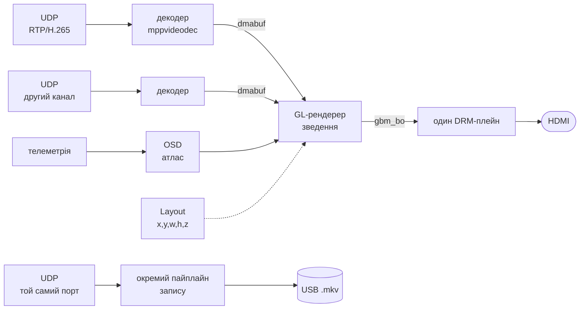

# VRX-GL

Приймальна станція цифрового FPV-лінка. Переписування [VRX](https://github.com/VTK-TEAM/VRX) з нуля заради переносимості між чіпами.

Приймає відео по UDP, виводить через DRM/KMS **без композитора й без X-сервера**, малює поверх OSD з телеметрії і паралельно пише на USB.

---

## Чому переписується

Старий VRX виводить кожен потік окремим апаратним плейном: відео, PiP, OSD — три незалежні вікна, які зводить VOP2. Це найдешевший можливий шлях за затримкою, але він **існує лише на RK3588**.

| Чіп | Незалежних вікон з лінійним NV12 |
|---|---|
| RK3588 | **4** (Esmart0-3) |
| RK3576 | **6** |
| RK3568 | **2** |
| **RK3566** | **1** |

На RK3566 `Cluster` приймає лише AFBC, `Smart` — лише RGB. Тобто трьохплейнова архітектура там не існує фізично, і оновленням ядра це не обходиться.

А цільове залізо — саме дешеві бокси: Orange Pi 5 коштує як десять коробок на схожому чіпі.

**Рішення:** один шар виводу, зведення шарів на GPU.

---

## Архітектура



Дві речі, які відрізняють це від старого проєкту.

**Один шар.** Відео, PiP і OSD зводить GPU у спільний буфер, який сканує єдиний плейн. Питання «скільки в цього чіпа вікон» зникає.

**Джерела реєструються самі.** Кожне має власний потік, буфери й розміщення; рендерер знає лише інтерфейс `FrameSource` і питає кадр щокадру. Кількість джерел не обмежена й міняється на ходу.

**Запис окремим пайплайном** зі своїм `udpsrc` на тому ж порту. Борт шле бродкастом, а ядро віддає копію кожної датаграми **кожному** сокету на порту — перевірено на цьому ядрі. Тому запис фізично не має шляху вплинути на тракт показу.

> Юнікаст так не працює: там `SO_REUSEPORT` **балансує** датаграми між сокетами, і кожен отримав би половину. Схема тримається на тому, що борт шле саме бродкастом.

### Ціна рішення

Зведення на GPU коштує смуги пам'яті: замість читання джерел напряму сканером додається запис зведеного кадру і його ж читання.

| | 1080p60 |
|---|---|
| Три плейни (старий VRX) | ~0.72 ГБ/с |
| Один шар + зведення | ~1.2 ГБ/с |

Приблизно **в 1.7 раза більше**. На RK3588 неістотно; на RK3566 з одноканальним LPDDR4 це головна стаття, але альтернативи там немає.

Важіль на запас: `RGB565` замість `XRGB8888` ріже трафік на 41% (ціль пише і сканер читає вдвічі менше).

---

## Заміри

Усе на живому залізі, Orange Pi 5 / RK3588 / Mali-G610.

**Зведення в 1080p** — три текстуровані прямокутники плюс 200 квадів OSD:

| Частота GPU | Тільки відео | Повне зведення |
|---|---|---|
| 1000 МГц | 0.70 мс | **1.06 мс** |
| 300 МГц | 0.97 мс | 1.70 мс |

Частоту знизили в **3.3 раза**, час виріс лише в **1.6**. Отже навантаження впирається **в смугу пам'яті, а не в шейдери** — тобто вдвічі слабший GPU у RK3566 не є вирішальним, вирішальна пам'ять.

**Вивід** (1366×768):

```
59.64 к/с проти 59.789 Гц розгортки | дропів 0 | прохід GPU 2.15 мс з 16.73
```

### 59.789, а не 60

Реальна частота екрана — не ціле число. Проти джерела на 60.000 fps це розбіжність 0.211 кадру/с, тобто **один кадр зсувається раз на ~4.7 секунди**, і жодна обробка цього не змінить.

Тому частота зберігається в **мілігерцах**: округлення до цілих знищило б саме ту інформацію, що визначає дрейф.

---

## Система координат

Усе — **частки 0..1** від верхнього лівого кута. Ні пікселя в логіці розкладки: монітори різні, а картинка має виглядати однаково.

Пропорція враховується окремо. `fit_source()` зменшує прямокутник до пропорції джерела й притискає його якорем — **чорні поля не малюються взагалі**, замість них просто менший прямокутник.

Якір — сітка 3×3:

```
TopLeft      TopCenter      TopRight
CenterLeft   Center         CenterRight
BottomLeft   BottomCenter   BottomRight
```

Відповідний кут відео торкається тієї самої точки прямокутника. Коли пропорції збігаються, якір ні на що не впливає.

---

## Збірка

```bash
cmake -B build -S . && cmake --build build -j$(nproc)
```

Залежності: `libdrm`, `gbm`, `egl`, `glesv2`, `gstreamer-1.0` (+ `app`, `video`, `allocators`).

GBM/EGL/GLESv2 мають братися з **вендорного** стеку Mali, не з Mesa. Перевірити:

```bash
ldd build/vrx_gl | grep -E "EGL|GLES|gbm"
# має бути /usr/lib/aarch64-linux-gnu/mali/...
```

## Запуск

```bash
sudo ./build/vrx_gl
```

Потрібен root: DRM master ексклюзивний. Графічну сесію застосунок зупиняє сам.

```bash
sudo ./build/vrx_gl --colortest   # три смуги R/G/B — перевірка порядку каналів
```

`--colortest` варто ганяти першим на кожній новій платі: якщо канали переставлені, видно за секунду, тоді як на службовій графіці це майже непомітно.

Очікуваний порядок — **зліва червона, посередині зелена, справа синя**. Інший
порядок означає, що формат буфера не збігається з тим, що реально йде в кабель:
на робочому столі це майже не видно, а все відео поїде в бік, і шукати причину
доведеться в декодері, у форматі кадру, будь-де, тільки не в порядку байтів.

Малюється трьома `glClear` із ножицями — **без шейдера й текстури**. Навмисно: з
перевірки викинуто все, що могло б само внести помилку. Смуги не ті — винен
формат буфера або сканування, і більше нічого.

> Режим існував у першій версії, коли `main` сам малював у dumb-буфер, і зник
> разом із тим тимчасовим кодом, щойно з'явився GL-рендерер. У README згадка
> лишилась — відновлено.

> Увесь лог іде в **stderr**. Під `sudo` він у деяких оточеннях губиться — тоді перенаправляти всередині привілейованої оболонки:
> ```bash
> sudo sh -c "./build/vrx_gl > out.txt 2> err.txt"
> ```

---

## Розгортання на чужій оранжі

> **Ця версія пройшла вдалі льотні випробування — 28.07.2026.**
> Станцію розгортали саме так: папка, один клік, робота в полі.

Передається **папка проєкту**, і більше нічого. Інженер відкриває її і
запускає один файл мишкою:

```
ЗАПУСТИТИ VRX-GL
```

Це **двійковий** файл, і це не примха. На XFCE кліком у папці не
виконується нічого текстового — перевірено на живій системі:

| що пробували | що робить файловий менеджер |
|---|---|
| `.desktop` у папці | віддає редактору ярликів XFCE (`xdg-mime`: `application/x-desktop`) — виглядає як «вікно мигнуло і зникло» |
| шелл-скрипт | відкриває в текстовому редакторі |
| **двійковий файл** | **виконує** |

Усієї роботи в запускачі кілька рядків: знайти себе через `/proc/self/exe`
і передати керування `scripts/run.sh` поруч. Через `/proc/self/exe`, а не
через поточний каталог — менеджер може запустити його звідки завгодно.

Далі `run.sh` сам відкриває собі термінал (менеджер запускає без нього, а
треба показати хід роботи й дати ввести пароль), робить перевірки й
піднімає станцію. Ні встановлення, ні ярликів на робочому столі, ні
правил `sudoers`.

### Чому скрипт має два режими

Це головне в `scripts/run.sh`, і причина не очевидна.

Станція забирає DRM master, а його тримає графічна сесія — отже її
доводиться гасити. Але вікно термінала, з якого нас запустили, живе
**всередині тієї самої сесії**: гасимо `lightdm` → падає X → падає вікно →
падає й сам скрипт разом зі станцією.

Ззовні це виглядає як «вікно мигнуло і зникло», і причина з цього не
читається взагалі. Саме через це в старому VRX був systemd-юніт: він від
сесії не залежить.

Тому робота розділена:

| режим | що робить |
|---|---|
| без аргументів | перевірки й збірка у **видимому** вікні, далі запуск наглядача окремим сеансом і вихід |
| `--supervise` | гасить сесію, тримає станцію, вертає робочий стіл після її зупинки |

### Чому `setsid` виявилось замало

Наглядач спершу відв'язувався через `setsid`. Станція піднімалась — і
одразу гинула, лишаючи в лозі один рядок `Terminated`, а на екрані спалах
і повернення робочого стола.

`setsid` міняє **сеанс**, але не виводить процес із **cgroup графічної
сесії**. А ми цю сесію самі й гасимо, щоб забрати DRM master — systemd
прибирає разом із нею все, що там лишилось, включно з наглядачем.

Тому наглядач піднімається через `systemd-run` власним системним юнітом,
поза будь-якою сесією:

```bash
systemd-run --collect --unit=vrx-gl --property=WorkingDirectory=<корінь> \
            bash scripts/run.sh --supervise
```

Заразом стало зрозуміло, навіщо в старому VRX був systemd-юніт: без нього
тут не обійтись у принципі. Зупинка — `sudo systemctl stop vrx-gl`.

### Решта зробленого навмисно

**Шляхи ніде не прибиті.** Ярлик передає скрипту власне розташування
(`%k`), корінь рахується від нього. Папка працює з будь-якого місця й під
будь-яким користувачем; у старому VRX шлях був вписаний у текст.

**Робочий каталог — корінь проєкту.** Не косметика: атлас OSD,
`osd_config.json` і картинки шукаються за відносними шляхами, і запуск із
іншого каталогу дав би відео без телеметрії — причому мовчки.

**Графічну сесію гасить скрипт, а не застосунок.** Застосунок це вміє, але
при кліку одразу після завантаження `lightdm` ще «запускається»:
`is-active` каже «ні», а DRM master він уже захопив. Ловилось наживо.

**Робочий стіл вертається завжди** — через `trap EXIT`, хоч після штатної
зупинки, хоч після падіння.

> Якщо пристрій виводу тримає щось стороннє, скрипт назве винуватця
> поіменно. Сам застосунок бачить лише `Device or resource busy`.

---
## Структура

```
display/
  display.hpp               типи + клас Display, БЕЗ жодного DRM
  display.cpp               DRM/KMS: режим, кільце буферів, події, гаряча заміна
render/
  gl_renderer.*             власний потік, кільце GBM-буферів, зведення
  gl_quad.hpp               шейдери, кеш текстур з dmabuf, малювання прямокутника
  overlay.hpp               інтерфейс оверлея: квади, текстури, знімок на кадр
  phase_meter.hpp           фаза приходу кадру: кругове середнє, дрейф, розкид
layout/
  layout.hpp                словник розміщення: x,y,w,h,z, якорі, вписування
source/
  frame_source.hpp          інтерфейс джерела кадрів для рендерера
  video_source.*            БАЗА: черга, буфери, сигнал, заміри
  h265_source.hpp           RTP + rtph265depay + h265parse + mppvideodec
  mjpeg_source.hpp          сирий UDP + jpegparse + mppjpegdec
osd/
  osd.*                     два потоки: приймач телеметрії й збирач квадів
  subtitle_writer.*         .ass поруч із .mkv: розкладка й дебаг-таблиця
  local_channels.*          що станція знає про себе: fps, запис, втрати
  osd_types.h               гліф, елемент layout, типи й пороги
  telemetry/                прийом UDP, сховище каналів, індекси
record/
  storage.*                 носій: пошук, монтування, стан, syncfs
  recorder.*                запис одного потоку, свій пайплайн і потік
control/
  camera_api.*              HTTP-клієнт камери
  phase_controller.*        ФАПЧ: веде частоту камери під розгортку
diag/
  link_monitor.*            хто винен у паузі — дорога чи борт
main.cpp                    ініціалізація й зупинка, більше нічого
```

### Потоки

Кожна підсистема живе у власному системному потоці. `main` **не має
покадрових викликів** — лише `init`, `start`, `stop`.

| потік | що робить |
|---|---|
| рендерер | зводить шари, віддає ціль дисплею |
| потік подій DRM | ловить flip і uevent-и монітора |
| джерело × N | свій GStreamer-пайплайн на канал |
| рекордер × N | свій пайплайн запису на канал |
| носій: пошук | `stat`/`opendir` на точці монтування |
| носій: `syncfs` | окремо, бо блокує на секунди |
| OSD: приймач | UDP-телеметрія, розбір кадру, сховище каналів |
| OSD: збирач | розкладка гліфів у список квадів, 20 Гц |
| OSD: субтитри | .ass поруч із записом, знімок раз на 500 мс |
| OSD: локальні канали | опитує підсистеми, кладе в те саме сховище |
| ФАПЧ | HTTP до камери раз на 500 мс |
| спостерігач лінка | читає RTP-заголовки |

Розділення не косметичне. Усе, що чіпає флешку, блокує в D-стані на
реальні секунди, коли її висмикнули, і не переривається нічим. Тому
назовні віддається лише знімок стану — читач не блокується ніколи.

`main` **не має покадрових викликів**. Кожна підсистема має власний потік і власний темп; ззовні лише `init`, `start`, `stop`.

Темп задає ланцюжок: підтвердження flip'а → present-колбек → умовна змінна → рендерер прокидається на звільнений буфер. Без опитування й без снів «на око».

---

## Стан

| | |
|---|---|
| ✅ | АПІ виводу, KMS-бекенд, вибір режиму, пінінг кольору |
| ✅ | GL-рендерер: власний потік, кільце буферів, fence, 59 fps без дропів |
| ✅ | Розкладка: якорі, вписування за пропорцією, порядок за z |
| ✅ | Реєстрація джерел: `FrameSource`, довільна кількість, свій потік у кожного |
| ✅ | Текстури з dmabuf, шейдери, текстуровані прямокутники |
| ✅ | Приймання й декод H.265, вимірювання фази й затримки |
| ✅ | Другий канал MJPEG, база з гачками замість гілок по кодеку |
| ✅ | Фазове автопідстроювання камери, затримка 10.5 мс |
| ✅ | Гаряча заміна монітора, скидання кешу EDID |
| ✅ | Запис окремим пайплайном на канал, свій носій-клас |
| ✅ | Спостерігач лінка: розрізняє втрату в дорозі й мовчання борту |
| ✅ | Батчинг квадів: гліфи одного напису йдуть одним викликом |
| ✅ | OSD і телеметрія: атлас, 5 розмірів, бари, горизонт, MM:SS |
| ⬜ | Керування розкладкою з RC-каналів |

### Що заміряно на залізі

| | |
|---|---|
| затримка декодер → екран | **10.5 мс** |
| наскрізна (світлодіод → екран) | ~49 мс, з них 2/3 — матриця й розгортка |
| збоїв показу | 0.04/с при запасі 4σ |
| прохід GPU, два шари 1080p | 2.7–3.4 мс |
| втрата запису при висмикуванні | ~6.7 с, файл цілий |
| втрати лінка | 0.015% на 590 тис. пакетів |

**Немає сигналу — не малюємо нічого.** Програма одна, а дрони різні: заглушки й рамки припускали б знання про конкретну конфігурацію, якого в програми немає.

### Цільові чіпи

RK3588 (Orange Pi 5) і RK3566 (дешеві бокси). Обидва мають `libmali` з GBM-бекендом і `EGL_EXT_image_dma_buf_import`, тож один код покриває обидва.

Utgard-чіпи (RK3328, RK3528, Mali-450) свідомо поза цілями: GLES лише 2.0, підтримка імпорту dmabuf під питанням, у плейнах немає масштабування.

---

## Журнал

### Рендерер: вимір фази окремо, `draw_frame()` розібрано

Структурна правка, поведінка не змінилась — перевірено на залізі:
похибка фази +0.05 мс, 58.9 к/с.

**Вимір фази виїхав у `phase_meter.hpp`.** Він сидів усередині
`draw_frame()` не з логіки, а через сусідство: саме там під рукою були
обидві мітки часу. Спільного з малюванням не має нічого, зате має власний
стан на три механізми — кругове середнє, регресія дрейфу, згладжений
розкид — і в чужій функції тонув.

Тепер це замкнена річ із трьома методами: `sample()`, `read()`, `reset()`.
Останній з'явився разом із переносом: при зміні виводу попередні виміри
стосуються **іншого періоду розгортки**, і тягти їх у нову конфігурацію не
можна. Раніше цього скидання не було взагалі.

**`draw_frame()` з ~215 рядків став 26.** Розібраний на три частини за
тим, що вони насправді роблять:

| функція | відповідальність |
|---|---|
| `collect_items()` | забрати кадри в джерел, вписати за пропорцією, впорядкувати за z |
| `draw_sources()` | намалювати вже готовий список |
| `draw_frame()` | почистити, зібрати, зміряти фазу, намалювати джерела й оверлеї |

**Колбек розгортки став іменованим методом `on_flip()`.** Це була лямбда
на сорок рядків усередині `init()` — там її ніхто не бачив, хоча вона
рахує дві метрики тракту: наскрізну затримку й крок зйомки між сусідніми
показаними кадрами.

Заразом прибрано `Config::card`: рендерер більше не відкриває карту, поле
лишалось мертвим із попередньої правки.

### Вивід: один клас, буфери в нього, і дві помилки, знайдені перевіркою

Модуль виводу переписано за три кроки. Перші два структурні, третій міняє
зону відповідальності.

**1. Клас `Layer` прибрано.** Він існував заради двох методів, і кожен
виклик виглядав як `display.layer().info()`. Лишився від початкової
багатоплейнової моделі — тієї самої, яку проєкт офіційно поховав ще на
початку. Абстракція над річчю, якої ніколи не стане дві, це чистий шум.

**2. Абстрактний інтерфейс і реалізація злиті в один клас.** Було
`DisplayManager` + `KmsDisplayManager`; стало `Display` на pimpl.

Абстракція окупається, коли дві реалізації потрібні ОДНОЧАСНО в одному
бінарнику або коли їх міняють без перезбирання. Ні того, ні того тут
немає: обидва цільові чіпи — це той самий DRM/KMS. А переносимість
забезпечувала не віртуальність, а **pimpl**: заголовок не тягнув
`<xf86drmMode.h>` і `<gbm.h>` і без неї. Перенесення на іншу платформу —
переписати `display.cpp`.

Розділення натомість коштувало: щоб зрозуміти поведінку, доводилось
тримати відкритими два файли, а інтерфейс мовчки відставав від
реальності — гаряче підключення в ньому не згадувалось узагалі.

Заразом прибрано мертве: `is_open()` (не викликався ніде), `description()`
(це дані — поле в стані), `set_pixel_clock()` і `set_crtc_property()` —
дослідницькі залишки, висновки з яких давно в цьому журналі.

**3. Буфери переїхали до дисплея.** Раніше їх виділяв рендерер — і для
цього відкривав ту саму карту ДРУГИМ дескриптором, робив на ній свій GBM,
експортував dmabuf, а дисплей імпортував їх назад. Уся ця подорож існувала
лише тому, що володіння було розділене навпіл.

| що | було | стало |
|---|---|---|
| дескрипторів карти | 2 | **1** |
| хто знає геометрію | дисплей + копія в рендерері | дисплей |
| облік зайнятості буфера | `pending/in_flight/current` у дисплея **і** лічильник посилань у рендерера | один автомат із п'яти станів |
| гілка «вивід змінився» | у циклі рендерера | порівняння цілого числа в цілі |

Тепер цикл рендерера це буквально «взяв ціль → намалював → віддав»:

```cpp
if (!dpy->acquire(target)) { wait_flip(100); continue; }
...
dpy->present(target);
```

`acquire()` віддає лише буфер, який точно не читається сканером — тому
рендерер не з'ясовує нічого про стан заліза сам.

> **`acquire()` навмисно НЕ блокує.** Рендерер після звільнення буфера ще
> спить до свого дедлайну опиту — блокуючий виклик дав би два послідовних
> очікування замість одного й розмазав темп кадру між двома класами. Про
> звільнення дисплей повідомляє колбеком, а коли брати — вирішує рендерер.

У рендерері лишилася одна річ, яку перенести не можна: `EGLImage` і FBO
над тим самим dmabuf створюються лише в потоці з поточним контекстом. Але
це **кеш**, а не джерело правди: заповнюється на перших кадрах і застигає.

#### Відкладене звільнення буферів

`destroy_ring()` звільняв усі буфери, включно з тим, у якому рендерер
малює просто зараз. Тобто на висмикуванні монітора ми закривали дескриптор
і віддавали пам'ять під активним проходом GPU.

Не падало це лише тому, що імпорт dmabuf у EGL тримає власне посилання —
інваріант тримався на поведінці драйвера, а не на нашому коді.

Тепер буфер у стані `Drawing` переїжджає в окремий список і чекає, поки
рендерер поверне його через `present()`. Ключ — **дескриптор, а не номер у
кільці**: кільця на той момент уже немає.

#### Перевірка, і чому перші дві спроби нічого не довели

Шість замін монітора кабелем, роздільності чергувалися. Витоку немає:
після кожного розбирання лічильник живих буферів доходив до нуля, у
сталому режимі завжди рівно 2. ФАПЧ перезахоплювалась, OSD
перемасштабовувався.

**Але сама правка при цьому не спрацювала жодного разу** — скрізь «0 чекає
рендерера». Порядок подій розводить конфлікт сам: спершу зупиняються
розгортки, рендерер добиває кадр і стає чекати, і лише потім, через
сотню мілісекунд дребезгу HPD, приходить uevent.

Перша спроба зловити примусово — розбирати вивід за таймером із випадковим
зсувом через `usleep` у потоці подій. **52 розбирання, нуль влучань.**
Логування станів кільця показало чому:

```
14 ×  Current InFlight        13 ×  InFlight Current
 3 ×  Free Free                1 ×  InFlight Pending
```

Тест зіпсував те, що міряв: поки він спав, flip'и не оброблялися, дедлайн
опиту зсувався, і рендерер починав малювати одразу після захоплення —
буфер проскакував `Drawing` за мілісекунди.

Правильно було збурювати не вимірювач, а **того, хто тримає буфер**.
Затримка переїхала в рендерер (`VRX_TEST_HOLD_MS`), і одразу:

```
36 із 38 розбирань застали Drawing -> відкладено -> звільнено
```

#### Вада, знайдена по дорозі: вивід не піднімався назад

Після примусового розбирання вивід **не відновлювався жодного разу за 24
секунди**. Показано 35 кадрів, номер конфігурації застряг на нулі.

`handle_hotplug()` викликався **тільки на uevent**. Періодична перевірка
існувала лише в гілці «сокет uevent не відкрився». Тобто якщо вивід зник з
будь-якої іншої причини — збій зонда при старті, невдалий
`configure_output()` — повторної спроби не було б **ніколи**: кабель ніхто
не чіпає, події не станеться.

Для станції це означало б чорний екран до перезавантаження, при живому
кабелі.

Тепер перевірка йде за таймером завжди: раз на секунду, поки виводу немає,
і раз на п'ять секунд як страховка, коли він є. Після правки — 11
відновлень з 12 розбирань.

> Тестові гачки `VRX_TEST_TEARDOWN=<мс>` і `VRX_TEST_HOLD_MS=<мс>`
> лишені навмисно. Без них цей шлях знову стане неперевірюваним: у
> нормальному темпі стан `Drawing` надто короткий, щоб у нього влучити
> ззовні.

### Субтитри й локальні канали

Два хвости до OSD, обидва з VRX.

**Телеметрія в .ass поруч із записом.** Формат той самий — абсолютне
позиціювання, тож у плеєрі показання стоять там же, де стояли на екрані.
Два файли: розкладка з `osd_config.json` і дебаг-таблиця всіх каналів.

```
20260728_075650_main.mkv
20260728_075650_main.ass          26 елементів розкладки
20260728_075650_main.debug.ass    92 канали в три колонки, з віком значень
```

Синхронізується з рекордером ОСНОВНОГО каналу через `RecordStats`: новий
файл запису тягне новий `.ass`, зупинка закриває. Рекордер сам ротує файли
за розміром і перезапускається на відновленні сигналу, тож звіряється не
лише прапорець запису, а й **ім'я файлу** — інакше другий і подальші файли
лишились би без субтитрів.

Носій питається через `record::Storage`, як і в рекордерів, і звіряється
**номер носія**, а не шлях: та сама точка монтування може дістатися вже
іншій флешці.

> Окремий потік тут не стиль, а вимога. Якщо флешку висмикнути просто під
> час `write()`, ядро (SCSI error recovery на USB) може не повертати
> керування реальні секунди. У VRX це вже ловилось: головний потік
> опинявся в D-стані саме в момент витягування, і разом із ним ставав увесь
> показ.

**Локальні канали** — те, що станція знає про себе, і чого немає в
радіотелеметрії:

| id | канал | звідки |
|---|---|---|
| 200 | стан запису | `Storage` + `Recorder`: 0 немає носія / 1 пише / 2 носій є |
| 201 | втрати в лінії | `SFP_TX_POINT − SFP_RX_STATION`, лише коли обидва свіжі |
| 202 | fps основного | `produced_hz` джерела |
| 203 | fps другого | те саме |
| 204 | дійшло до екрана | приріст `taken` рендерера |
| 205 | частота показів | приріст `presented` дисплея |

У VRX це рахував головний цикл; тут — окремий потік, який опитує підсистеми
раз на пів секунди. Підсистеми про OSD не знають і не повинні: знімок стану
кожна з них і так віддає, і він ніколи не блокується.

Пара 202/204 нарізно не випадкова. Заміряно з увімкненою ФАПЧ:

```
202 H265_FPS         59.0     прийнято й декодовано
204 H265_SHOWN_FPS   59.0     дійшло до екрана
205 DISPLAY_FPS      59.0     екран оновився
```

Три числа зійшлися — між декодером і екраном не гине нічого. З вимкненою
петлею 204 гуляв 50..60, і це був не шум виміру, а справжні втрати.

Дві дрібниці, знайдені при переносі. Частоти згладжуються ЕМА з постійною
2.5 с: за пів секунди у вікно потрапляє ~30 кадрів, і похибка в один кадр це
вже ±2 к/с на екрані. І в дебаг-таблицю додано канали 202-205 — у VRX туди
внесли лише стан запису й втрати, хоча при розборі польоту потрібні саме
частоти: по них видно, ДЕ загубились кадри.

### OSD: перенесено з VRX, змінено лише вивід

Телеметрія поверх відео. Уся змістовна логіка з VRX збережена дослівно —
формат атласу, `.bin` гліфів, `osd_config.json`, розбір UTF-8, синтаксис
`<icon>`, п'ять розмірів, типи `LABEL`/`VALUE`/`ENUM_SWITCH`/`BAR`/`HORIZON`,
правила протухання каналів. Змінено **рівно одне**:

```
було:  CPU alpha-blit гліфа -> ARGB8888 dumb-буфер -> свій DRM-плейн
стало: квад із координатами гліфа -> список -> GL у спільний кадр
```

Разом із плейном відпали подвійна буферизація dumb-буферів, `IPlaneSource`,
`PlaneState` і ping-pong по `on_presented` — тут кадр один на всіх.

**Два потоки, як і решта підсистем.** Приймач телеметрії (UDP 50122,
власний сокет) складає значення в сховище. Збирач раз на 50 мс читає
сховище, форматує рядки й публікує готовий **список квадів**. Рендерер
щокадру бере останній знімок і малює. Тобто темп OSD ніяк не пов'язаний
з темпом показу, і повільне форматування рядків не може з'їсти vblank.

**Чому квади, а не готовий буфер.** Напрошується простіше: хай OSD малює
себе в ARGB-буфер, а рендерер вантажить його текстурою — саме так було в
VRX. Але це коштувало б повного завантаження екрана в GPU щоразу, коли
змінилась одна цифра: 1366×768×4 = 4.2 МБ, при 20 оновленнях на секунду —
84 МБ/с. На RK3566 смуга пам'яті і є головна стаття. Двісті квадів
натомість це 19 КБ вершин.

| | |
|---|---|
| квадів у списку | 172 |
| збірка списку | **0.2 мс** (в окремому потоці) |
| прохід GPU | 2.5 -> 3.72 мс |
| телеметрія | 565 пакетів, 0 збоїв CRC |

Більша частина зростання GPU — не двісті гліфів, а **горизонт**: картинка
1080×1080 на всю висоту екрана, з альфою, тобто читання цілі по всій площі.
Якщо колись стане тісно в бюджеті — дивитись треба туди.

#### Атлас будувався для GL, і це нарешті видно

У VRX над `blit_glyph()` висів чесний коментар: `.bin` зберігає
нормалізовані 0..1 координати, а що вони означають у пікселях екрана —
довелося вгадувати. Взяли «частку ширини екрана».

Перевірка на самих даних показала, що це було неправильно:

```
атлас 2048x1400,  гліф 'p':
  g.width * atlas_w  = 14.0    g.height * atlas_h = 23.0
  для п'яти розмірів: 14, 21, 28, 34, 42 — РІВНО цілі
  як частка екрана 1366x768:  9.3 x 12.6 — не цілі, ще й інша пропорція
```

Числа нормалізовані на розмір **атласа**, і «рендер 1:1» з `osd_types.h`
означає власний піксельний розмір гліфа. У CPU-версії літери виходили б
сплюснуті, бо пропорції атласа й екрана різні.

#### Вісь виводу дзеркальна, і відео це приховувало

Орієнтацію довелося ловити трьома кроками, і кожен був інформативний:

| що зробили | що побачили | висновок |
|---|---|---|
| природне відображення `1-2y`, `v` як є | дзеркальне все | десь один переворот зайвий |
| `v = 1 - v` | **змазки по екрану** | так не можна: формула переносить вибірку в дзеркальний прямокутник атласа, гліф тягне чужі пікселі |
| переворот `v` у межах клітинки | гліфи правильні, місця переплутані | дзеркальний саме ВИВІД, не вміст |

Тому переворот один і в одному місці — у рендерері, для позиції. Оверлей
лишається в координатах картинки (Y вниз, `v` вниз) і про GL не знає.

Відео цього не помічає з тієї ж причини, з якої помилку було важко
впіймати: воно малюється одним прямокутником на весь екран і перевертає
свої текстурні координати, тож два дзеркала гасять одне одного. На суцільній
картинці різниці не видно — на двохстах дрібних квадах видно одразу.

#### Час — властивістю елемента, не винятком у коді

Канал `FLIGHT_TIME(19)` віддає сирі секунди; переводив їх у `MM:SS` старий
`OsdTelemetryService`, якого в цьому тракті немає (у конфізі про це лишався
TODO). Додано поле `FORMAT`:

```json
"flight_time_display": { "DATACHANNEL": 19, "FORMAT": "MM:SS", ... }
```

Нулі попереду навмисно: ширина рядка стала, і сусідні елементи не сіпаються,
коли кількість цифр міняється. Наступний канал із таким поданням обійдеться
правкою конфігу.

### Запис, другий канал і гаряча заміна монітора

Довгий день, у якому три дефекти ховалися за успішними лічильниками.

#### Кеш текстур ключувався номером дескриптора

Симптом описав користувач: рухома рука «вібрує», ніби показується
попередній кадр і одразу правильний. **Рух назад**, не пропуск.

Усі лічильники показували ідеальний тракт: 0 повторів, 0 пропусків за
164 секунди, крок зйомки рівномірний, фаза захоплена. У вікні
`xvimagesink` той самий потік ішов чисто. Камера з трімом 0 і з трімом
−2000 давала нуль дублікатів на 1200 кадрах.

Причина: `DmabufTextureCache` ключувався `fd[0]`. Коли `GstSample`
звільняється, GStreamer закриває дескриптор, і ядро згодом видає **той
самий номер іншому буферу**. Звірка перевіряла лише розмір, формат і
крок — у сталому потоці вони незмінні, тож збіг проходив. `EGLImage`
тримає власне посилання на СТАРИЙ буфер, і на екран ішли пікселі
минулого.

Лічильники цього не бачили, бо міряли, **які** кадри взято з черги, а
помилка була в тому, **що** з них намальовано.

Ключ тепер — інода dmabuf: унікальна на буфер, живе рівно стільки, як
він сам. Ціна — `fstat` на кадр.

Підтверджено зйомкою швидкісною камерою: тестові світлодіоди з кроком
8 мс до фіксу йшли назад, після — уперед.

#### Фільтр опорного кадру стояв після муксера

Запис ішов бездоганно: 143 МБ, лічильники росли, помилок нема. Файл не
відкривався нічим.

`start_on_keyframe` відкидав буфери з прапорцем `DELTA_UNIT`, і проба
стояла на вході `filesink` — тобто **після** `matroskamux`. Там прапорець
стосується вже блоків контейнера, і під роздачу потрапив службовий буфер
із заголовком EBML. Файл починався з `Cluster` замість `1a45dfa3`.

Гейт має стояти на виході парсера, де кадр це кадр.

#### `matroskamux` за замовчуванням не переживає обриву

Знайшов користувач. Муксер при завершенні **повертається назад по файлу**
й дописує тривалість і таблицю переходів. Поки запис закривається
штатно — добре. Але цей запис за задумом обривають: висмикують флешку,
знімають живлення. Тоді дописувати нікуди.

Заміряно: після висмикування носія 417 МБ і 267 МБ не читалися взагалі.
Зі `streamable=true`, перевірено найжорсткішим випадком (SIGKILL, без
жодного шансу закритись) — файли читаються з правильною тривалістю.

#### Запис: архітектура

Окремий пайплайн на канал, окремий потік, окремий `udpsrc`. Спільного з
показом немає нічого — ні елемента, ні буфера, ні сокета. Борт шле
бродкастом, ядро віддає копію кожної датаграми кожному сокету на порту.

**Не декодуємо.** Пишеться стиснений потік як є: на RK3588 апаратний
декодер один на всіх, і другий `mppvideodec` конкурував би з показом за
той самий `mpp_service`.

Розмір файлу рахує пад-проба, а не `stat()` — жодного звертання до
файлової системи з логіки, яка має лишатись живою при зриві носія.

Файл не створюється, поки немає сигналу. Раніше пайплайн піднімався,
щоб дізнатися, чи є кадри, і при вставленій флешці з вимкненою камерою
виходив цикл «відкрив → 3 с тиші → закрив»: 10 файлів по 336 байтів за
40 секунд. Тепер живість дає легка проба — власний UDP-сокет без
GStreamer.

#### Черга й `syncfs`: дві помилки поспіль

Спершу поставив чергу 3 секунди й прибрав періодичний `syncfs`,
вирішивши, що опція монтування `flush` (udisks ставить її знімним
носіям) робить те саме.

Замір спростував: висмикування коштувало **понад 20 секунд** відео, а
хвіст файлу вийшов сміттям — програвач показував 17 хвилин і зависав
після першої.

Повернуто як у старому VRX: `syncfs` кожні 5 с, черга маленька й **з
витоком**. Велика черга не «пересиджує» ступор флешки, а перетворює його
на втрату всього хвоста; з витоком при переповненні гине найстаріший
кадр, а гілка не блокується. Друге робить перше безпечним: `syncfs` на
цій флешці триває 3.1 с і зрідка впирається на десятки секунд, але
маленька черга при цьому просто протікає.

Після правок: втрата **6.7 с**, файл цілий. Нижче ~4–5 с на цьому носії
не опуститися — стільки триває сам виклик.

#### Гаряча заміна монітора

`open()` більше не вимагає підключеного монітора. Події — з uevent-сокета
ядра у наявному циклі подій DRM. Реагуємо лише на реальну зміну стану:
uevent-и приходять і на власні modeset-и, тож реакція на кожен означала б
нескінченний цикл.

Рендерер стежить за **номером конфігурації**, а не за розміром: новий
монітор може мати ту саму роздільність, але це вже інший CRTC і плейн, і
старі фреймбуфери на ньому недійсні.

Окремо довелося скидати кеш EDID. Драйвер HDMI цього ядра оновлює його
лише на справжньому переході в `disconnected`; повторний зонд —
і `drmModeGetConnector`, і `echo detect` — віддає кеш. Через це DELL
SE2216H із рідними 1920x1080 читався як Philips 196VL і працював у
1366x768, тобто ми ще й масштабували 1920→1366 просто так. Помітив
користувач: «фулхд-монітор не може просити 1366». Лікується прогоном
коннектора через примусовий `off` → `detect` у sysfs.

#### Другий канал виявився іншим кодеком

Порт 5001 у старому VRX — це `MjpegVideoSource`, не h265. Камера шле
сирий JPEG по UDP **без RTP-обгортки**; межі кадрів шукає `jpegparse` по
маркерах SOI/EOI. Декодер — `mppjpegdec`, бо софтверний `jpegdec` віддає
системну пам'ять замість dmabuf, і кадри мовчки гинули б на імпорті.

`VideoSource` став базою з трьома гачками (`caps`, `parse_chain`,
`decoder`), конкретика — у нащадках. Черга, зливання, детекція сигналу й
заміри лишились у базі в одному екземплярі.

**Синхронізація — лише по першому джерелу.** Розгортка одна, а кожна
камера має свій кварц. Раніше фаза бралася як максимум `produced_ns` по
всіх джерелах; з однією камерою це збігалося, з двома петля вела б то
одну, то другу.

#### Запас петлі: 4σ

| | запас | затримка | збоїв |
|---|---|---|---|
| 3σ | 3.9 мс | 8.6 мс | 0.37/с |
| **4σ** | **4.9 мс** | **10.5 мс** | **0.042/с** |
| 5σ | 6.6 мс | 12.9 мс | 0.035/с |

Третя сигма купує дев'ятикратне зменшення, п'ята не купує нічого:
різниця в межах шуму, а затримка росте на 2.4 мс. За 4σ хвіст джитера
вичерпано, і решта збоїв має іншу природу — на 4σ повтори й пропуски
йшли строго попарно (13 і 13), на 5σ пари розсипались.

#### Спостерігач лінка

Лічильники кажуть «кадру не було» і спиняються. Але це має дві причини з
протилежним лікуванням: пакети загубились у дорозі чи камера нічого не
слала. Розрізняє їх рівно одне — номери послідовності RTP.

Привід був конкретний: паузи 1117/633/1933 мс поспіль, при цілком
нормальних розмірах кадрів до і після (26–29 КБ при середньому 26.8).
Кодер явно ні до чого, але довести «лінк» по мітках часу неможливо.

Тепер інциденти йдуть у `/tmp/vrx_link.log` із часом доби, кожен рядок
скидається на диск одразу.

---

Записи від найновішого. Наповнюється на кожен коміт.

### Фазове захоплення на живому лінку: 0.06 втраченого кадру на секунду

Петля замкнулась. Фаза приходу кадру стоїть, затримка не гуляє, мікроривки зникли.

| | вільна фаза | захоплено |
|---|---|---|
| Наскрізна затримка | 11–17 мс, гуляє | **10.2 мс**, стабільна |
| Похибка фази | — | **±0.2 мс** |
| Дрейф | −14.6 мс/с | **−0.1 мс/с** |
| Повтори + дропи | ~10/с (8% кадрів) | **0.06/с** |
| Нових кадрів на показ | 57.0/с | **58.9/с** з 58.926 Гц |

За 166 с усталеного режиму — 10 втрачених кадрів разом, у 78 вікнах із 83 не сталося нічого.

**Актуатор — довжина кадру матриці.** `fpsTrimMilliHz` в OpenIPC/waybeam доходить до `pCus_SetFPS`, той перераховує VTS сенсора IMX335. Заміряно по семи точках: підсилення 0.95 мГц на мГц команди, лінійне й повторюване до третього знака.

> **Стеля одностороння.** Матриця вміє сповільнюватись, але не прискорюватись вище за апаратну межу режиму (60 Гц на 1080p; 120 було б лише з кропом). Перевірено: `+2000` не рухає ні таймінг, ні лічильник кадрів — команда просто гине. Тому рівновага петлі мусить лежати **нижче** цієї стелі.

**Тому розгортка опущена до 59 Гц** — рядками гасіння, не клоком:

```
vtotal 798 -> 809,  59.790 -> 58.977 Гц
рядкова 47.712 кГц і піксельний клок 85500 кГц НЕ змінюються
```

Міняти натомість клок (як робив прибраний `genlock`) означало б зсунути й рядкову частоту, а саме до неї підлаштовується приймач сигналу. Робоча точка тепер −1150 мГц: тисяча мілігерц запасу вгору й дві вниз замість колишніх 210 мГц до стелі. Це той самий прийом, що й VTS на матриці — з обох кінців тракту частота підганяється довжиною кадру.

**Ціль фази не задана числом:** `точка_опиту − 3σ`, обидві величини вимірювані. Запас у сигмах, а не в мілісекундах, тому він їде сам: чистіший лінк — менша затримка, гірший — більший запас. Заміряно обидві точки:

| запас | затримка | втрати |
|---|---|---|
| 2σ | 8.0 мс | 3.6/с |
| **3σ** | **10.2 мс** | **0.06/с** |

2.2 мс купують шістдесятикратне падіння втрат, і то з тієї частини затримки, що є чистим чеканням vblank'а, а не обробкою.

#### Три помилки, кожна з яких робила петлю сліпою або нестійкою

**1. Кутову величину не можна усереднювати ЕМА.** Фаза фільтрувалася ЕМА з α=0.02 по «найкоротшій дузі». Поки фаза стоїть — працює. Але вона повзе, а швидкість, яку такий фільтр здатний відстежити, обмежена: за крок він підтягується щонайбільше на α·півперіоду, тобто ~10 мс/с. При більшому дрейфі відставання переростає півперіоду, різниця по колу перекидає знак, і фільтр їде **назад**. На виході — рівна правдоподібна цифра (−3.6 мс/с), незмінна від будь-якого керування.

Стало — **кругове середнє** на вікні 250 мс: складаємо одиничні вектори кутів, беремо аргумент суми. Обгортки для такої операції не існує. Довжина тієї ж суми дає розкид безкоштовно.

**2. Фаза — інтеграл частоти, тож частотний зсув із неї не здобути.** Петля з інтегральною ланкою по фазі не захоплювалася при різниці 857 мГц: потрібні їй −904 мГц лежать поза пропорційною ланкою (kp × півперіоду = 382), а інтеграл не накопичувався — фаза оберталася за 1.15 с і знак помилки перекидався швидше, ніж встигало накопичитись.

Стало — **дві ланки**: частоту веде інтегратор по виміряному дрейфу (він обгортки не має взагалі), фазу — пропорційна ланка поверх нього.

**3. Ланки боролися між собою.** Фазова ланка рухає фазу єдиним способом — навмисно розстроюючи частоту. Частотна бачила цей зсув як помилку й прибирала. Лікується двома речами: частотна ланка віднімає власний внесок петлі (з затримкою в 1 с — рівно стільки відстає вимір дрейфу), і її смуга втричі вужча за фазову (`kf=0.10`, стала 5 с). Частотній лишається тільки повільний хід кварцу від нагріву.

Заразом дрейф став міряти нахилом по вікну 2 с замість різниці двох сусідніх середніх: шум упав з ±2.3 до ±0.3 мс/с, і тримінг перестав блукати.

#### Заміри, що знадобилися по дорозі

- **Частота камери** — по лічильнику кадрів на вікні 1–30 с, як і частота розгортки. Саме розбіжність між нею й таймінгом сенсора викрила механізм старого тримінгу.
- `--no-phase` і `VRX_PHASE_DEBUG=1` — без сирих рядів цю історію не можна було б розплутати.

> **Хибний слід, що коштував найдорожче.** У попередній прошивці `fpsTrimMilliHz` міняв **кількість** кадрів, а не момент їх зняття: лічильник слухався команди до мілігерца, а таймінг матриці стояв мертво. Дублювання й викидання кадрів фазу не рухає взагалі — викинутий кадр переносить прихід на період камери, а це по модулю періоду екрана −0.07 мс. Розрізнити це можна лише двома незалежними вимірами: скільки кадрів прийшло і **коли** вони прийшли.

#### Що лишилось

Гарячого підключення дисплея немає: конектор читається один раз при відкритті, uevent'и ядра ніхто не слухає. При перепідключенні режим не відновиться, а якір лічильника vblank'ів дасть довільну частоту — і петля впевнено поведе камеру за нею. Скидання якоря тут обов'язкове.

### `6dd29b4` — Приймання H.265 і затримка 37 -> 13 мс

Живе відео з борту на екрані. Але головний зміст кроку — розслідування затримки.

**Розклад тракту** (заміряно на живому борті, 1080p60):

| Ділянка | Час |
|---|---|
| Депей + парс + декод | 1.9 мс |
| Зведення GPU | 2.8 мс |
| **Очікування розгортки** | **8–14 мс** |
| Разом декодер → екран | 13–17 мс |

Тобто обробка коштує 4.7 мс, решта — чекання vblank. І воно дорівнює **`період − фаза`**, де фаза — де в періоді розгортки опиняється прихід кадру. Підтверджено на живих даних: поки фаза сповзала з 16.2 до 10.6 мс, затримка впала з 17.0 до 11.2 — рівно на ті самі 5.6 мс.

**Чотири помилки, кожна з яких давала видимий артефакт:**

1. `acquire()` повертав `false`, коли немає **нового** кадру. Джерело 30 к/с проти показу 60 Гц зникало з екрана кожен другий показ — мигання на 30 Гц, **якого не видно по жодному лічильнику**. Ловиться тільки оком.
2. Черга без активного зливання набирається до стелі й застрягає: джерело 60.00 проти показу 59.789, розсмоктатись нема з чого. 2.5 кадру = 37 мс сталої затримки. Тепер надлишок зрізається з голови при кожному заборі.
3. Опит одразу після flip'а систематично застає кадр у дорозі: він готовий не на початку періоду, а через 5–11 мс.
4. Шейпер на борті 48 Мбіт/с пакетує **кожен** кадр, а розмір гуляє 7–64 КБ — звідси ±6 мс розкиду. Знято: відхилення інтервалів 8.6 → 2.9 мс. Заразом виявилось, що захищатися не було від чого: GOP=6, IDR лише в 1.1 раза більший за P-кадр.

### Керування фазою: чому з боку дисплея не вийде

Затримку можна було б зафіксувати на ~5 мс, підвівши фазу до точки опиту. Для цього треба зсунути сітку розгортки. Перевірено три шляхи, **жоден не придатний**:

| Шлях | Працює? | Екран |
|---|---|---|
| Зміна піксельного клока (modeset) | так, ~2.5 мс/с | **гасне** |
| `min/max refresh rate` + `VRR_ENABLED` | так | **гасне** |
| Тільки `variable refresh rate` | так, ~1.4 мс/с | **блимає** |

Трасування ядра (ftrace) показало точну причину для кожного:

```
перші два:  vop2_crtc_atomic_disable <-disable_outputs   ← повний modeset
третій:     rockchip_connector_update_vfp_for_vrr <-vop2_crtc_atomic_begin
            (БЕЗ disable_outputs — драйвер робить усе правильно)
```

Третій шлях **безшовний з боку драйвера** — у ядрі є `rockchip_connector_update_vfp_for_vrr`, він міняє передній фронт без перезапуску таймінгів. Але властивість цілочисельна: мінімальний крок це 1 Гц з 60, тобто **1.7%**. Приймач сприймає такий стрибок як новий сигнал і перезахоплює синхронізацію. Перевірено на двох різних моніторах — блимає на обох.

> **Висновок:** актуатор керування фазою має бути на боці **камери**, а не дисплея. Наземка фазу вже вимірює; борту досить один раз затримати захоплення на N мс. Ризику для тракту показу — нуль.

Також перевірено й відкинуто: `DRM_CAP_ASYNC_PAGE_FLIP` заявлений, прапорець приймається, але **події flip'а не приходять** — у VOP2 немає `atomic_async_update`, тож відстежувати час життя буфера нічим.

### `7d3faec` — Текстури з dmabuf і шейдери

Заливка кольором замінена на справжнє семплювання. Шлях той самий, яким піде відео: `dmabuf → EGLImage → GL_TEXTURE_EXTERNAL_OES`.

- Дві шейдерні програми закладено: `samplerExternalOES` для кадрів, `sampler2D` для майбутнього атласу OSD — різні типи GLSL, в одну програму не компілюються. Перемикань за кадр буде одне, не по одному на прямокутник.
- Кеш текстур за dmabuf-дескриптором **зі звіркою метаданих**. Без звірки: при зміні роздільності джерело звільняє пул, ядро видає новим буферам ті самі номери дескрипторів, і кеш віддав би стару текстуру на новий буфер — застигла картинка без жодного повідомлення.
- `TestSource` тепер віддає справжні dmabuf: три буфери з ротацією, градієнт для перевірки орієнтації, біла рамка для меж, смуга-маркер буфера.

**Y-переворот довелося виправляти за фактом.** Для текстури з dmabuf `v=0` лежить **знизу**, а перший рядок буфера — зверху. Перша версія робила навпаки, і картинка вийшла догори дриґом: червоний градієнт (росте вправо) опинився внизу замість верху.

**Заміряно:** 59.79 к/с проти 59.789 Гц, дропів 0, прохід GPU 3.24 мс з 16.73 (19% бюджету) — два текстуровані прямокутники замість двох заливок.

**Побічно про тестовий стенд:** монітор підключений через адаптер HDMI→VGA, тобто сигнал аналоговий. Його auto-adjust підбирає фазу семплювання й позицію за межами картинки, тому на пілларбоксі центрує по вужчому вмісту зі скосом. Це артефакт **стенду**, не проблема зведення: з цифровою панеллю навпростець такого немає.

### `f04ce4e` — Джерела реєструються самі

Зміна концепції. Було: рендерер знає про «канал 0» і «канал 1». Стало: кожне джерело самодостатнє — свій потік, свої буфери, своє розміщення — і реєструється саме.

```cpp
renderer.add_source(std::make_shared<H265Source>(5600));
renderer.add_source(std::make_shared<AnythingElse>());
```

- `FrameSource` як єдина точка зчеплення. Рендерер не знає, що за джерело.
- Питає **рендерер**, не джерело штовхає. Звідси темп від того, хто показує, і «перемагає найсвіжіший» безкоштовно: зайвий кадр перезаписується в слоті, черга не росте.
- Клас `Layout` із фіксованими каналами прибрано; лишився словник — `Placement`, `Anchor`, `fit_source()`.
- Розмір джерела перевіряється **щокадру**, не за таймером: це три порівняння цілих, тоді як раз на секунду означало б до 60 кадрів із неправильною геометрією. Привід реальний — електронна стабілізація ріже роздільність кропом на ходу.
- **Перевірено на екрані:** 4:3 у 16:9 дає симетричні стовпчики; PiP 16:9 і 4:3 однаково торкаються кутом заданого кута.

Три інваріанти записано коментарями просто в коді, бо ціна помилки в кожному — тиха:

| Інваріант | Що буде, якщо порушити |
|---|---|
| `acquire()` не блокує | пропущений vblank |
| звільнення неявне (наступний `acquire`) | розриви картинки без повідомлення, якщо з'явиться конвеєр |
| пул декодера ≥ 3 | джерело стане, чекаючи буфер |

### `653db2f` — README

Опис проєкту, заміри, конвенції та цей журнал.

### `588d8d8` — Розкладка

Клас `Layout`: бажане розміщення каналів у частках 0..1, без жодних знань про залізо.

- Два прапорці на канал — `enabled` (розкладка хоче) і `source_present` (потік є). Різні події, різні причини, тому не зливаються в один.
- Якір як сітка 3×3 замість двох `float`: невалідне задати неможливо, а `switch` без `default` попередить про забутий випадок.
- `fit_source()` — вписування за пропорцією з притисканням якорем, без чорних полів.
- `snapshot()` — узгоджений зріз із уже відсортованим порядком; читання полів по одному дало б смикання на кадр.
- Перевірено 32 твердженнями: пілларбокс, леттербокс, усі якорі, PiP у куті, збереження `source_present` при swap.

### `db5297f` — Рендерер

Тракт виводу закрито: кадр малює GPU прямо в буфер, який сканує контролер.

- Власний потік, ззовні лише `init`/`start`/`stop`. Жодного покадрового виклику з `main`.
- Пакування без опитування: present-колбек сигналить умовну змінну.
- Буфери виділяє рендерер через GBM (`SCANOUT|RENDERING`), дисплей лише імпортує dmabuf. Ланцюжок `gbm_bo → fd → EGLImage → renderbuffer → FBO`.
- Fence обов'язковий: `glClear` повертає керування до того, як GPU щось зробив. `IN_FENCE_FD` на цьому ядрі немає, тож чекаємо у своєму потоці.
- **Заміряно:** 2.15 мс з 16.73, 59.64 к/с, дропів 0.

### `cbefd10` — АПІ виводу і KMS-бекенд

- `display_manager.hpp` — рівно **один** шар; багатоплейновість прибрана як поняття.
- Частота в мілігерцах, `crop` у кадрі, `keepalive` як контракт часу життя буфера.
- KMS: пошук ланцюжка коннектор → CRTC → плейн, режим `PREFERRED`, частота з піксельного клока.
- Колір пінимо явно — і `max bpc` (mainline), і `color_depth`/`color_format` (Rockchip BSP). Було `ycbcr444`, тобто дві зайві конверсії RGB→YCbCr→RGB; стало `rgb` + 24 біт.
- Три стани кадру: `pending` / `in_flight` / `current`. Буфер звільняється не після коміту, а коли перестав бути `current`.
